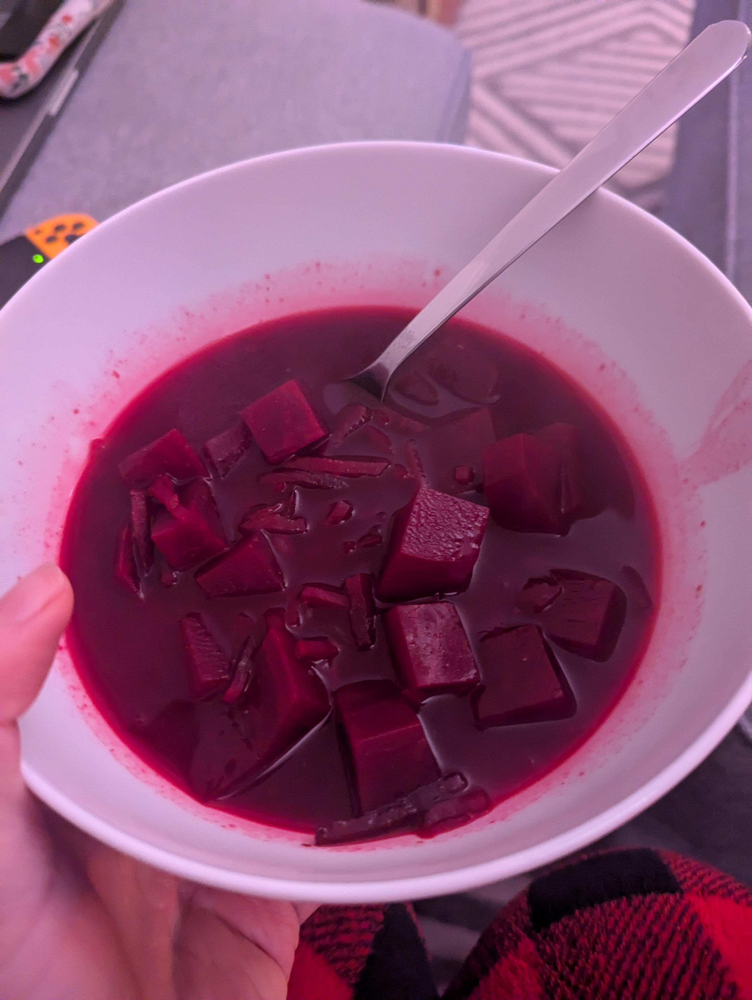

# Barszcz (lazy edition)
Want Barszcz but are too lazy? Here's what you do.

## Ingredients
- A bunch of beets
- 2/3 tbsp red wine vinegar (balsamic will do in a pinch)
- 1 tbsp soy sauce
- 1 beef bouillon cube
- 2-3 chicken bouillon cube
- This is the hack: 1 pouch Winiary barszcz czerwony 

## Steps
1. So you fill pot with water, add the cubed beets and powder mix.
2. Once it boils add bouillon cubes (use a cup to take out the boiling water and mix the cubes separately with a fork until they are diluted and then put back into pot)
3. After it cooks for an hour or so add the vinegar and soy sauce.