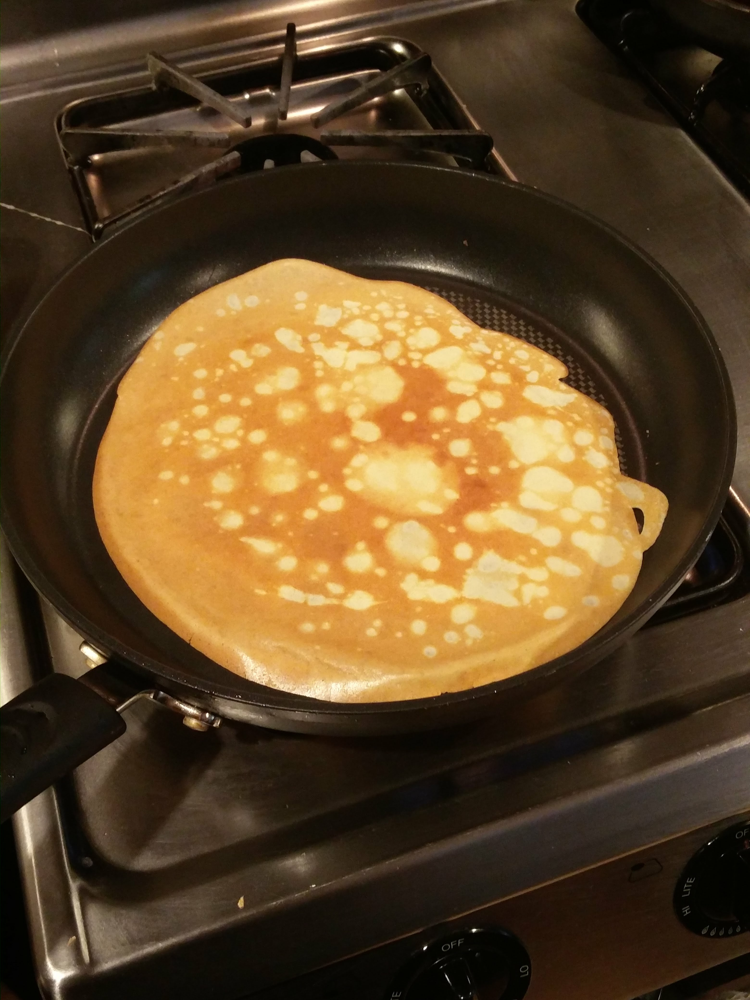

# Crepes
I once made 150 of these in one night. The night before I went away to uni. My parents froze a bunch of them.

## Ingredients
- 2 cups flour
- 1/2 cup sugar
- 1 tsp salt
- 60ml melted butter
- 2 cups milk
- A dash of vanilla extract
- 2 eggs (test and double check this... it's either 2 or 4)

## Steps
1. Melt the butter, let it cool on the counter 
2. Sift the flour, sugar and salt together into a bowl
3. Beat the eggs. Add to the dry mixture slowly
4. Mix the vanilla into the milk. Slowly add to the dry mixture
5. Add the room temperature butter. If it's still hot, the butter will re-solidify when it gets mixed in
6. Filter the mixture through a strainer into a fresh bowl
7. *Optional: Let rest for 2 hours in the fridge, then pull out 30 minutes before cooking.* 
8. pre-heat a thin pan on medium heat. Pour the batter and swivle the pan around to spread it around as widely as possible. Wait about 30 seconds, then flip. The cooked side should be LIGHTLY browned. Note: your first one is going to coat the pan with butter from the batter and will probably be bad. It'll get better. 

