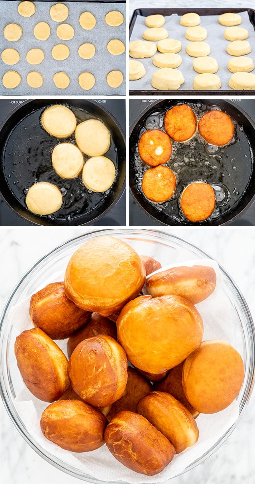

# Pączki (donuts)
Note to self: confirm with Dziadek that this is right.

(photo from: https://www.jocooks.com/recipes/paczki/)

## Ingredients
- 2 packages active dry yeast (4 1/2 teaspoons)
- 1 1/2 cups milk, warm, about 110 F
- 1/2 cup granulated sugar
- 1/2 cup butter, at room temperature
- 1 large egg, at room temperature
- 3 large egg yolks, at room temperature
- 1 tablespoon brandy or rum
- 1 teaspoon salt
- 4 1/2 to 5 cups all-purpose flour (about 20 1/4 ounces to 22 1/2 ounces)
- 1 gallon vegetable oil, for deep-frying
- *Optional:* About 1/2 cup granulated sugar, for rolling
- *Optional:* About 1/2 cup confectioners' sugar, for rolling
- *Optional:* 1-2 cups jam or fruit paste, for filling

## Instructions

**Prepare the dough**
1. Add the yeast to the warm milk. Stir to dissolve and set aside.
2. In a large bowl or stand mixer fitted with the paddle attachment, cream together the sugar and butter until fluffy.
3. Beat in the egg, egg yolks, brandy or rum, and salt until well incorporated.
4. Still using the paddle attachment, add 4 1/2 cups flour, alternating with the milk-yeast mixture. Beat for 5 or more minutes by machine or longer by hand until smooth. (Old-fashioned directions call for beating the dough with a wooden spoon until it blisters.) The dough will be very slack. If it's too soft, add the remaining 1/2 cup flour but no more.
5. Place the dough in a greased bowl. Turn to grease the other side.
6. Cover the top with plastic wrap and let rise until doubled in bulk, anywhere from 1 to 2 1/2 hours.
7. Punch down and let rise again, about 45 minutes.
8. Turn dough out onto a lightly floured surface. Pat or roll to 1/2-inch thickness. Cut rounds with a 3-inch biscuit cutter close together so you will have minimal scraps. Remove scraps and reroll and recut.
9. Cover the sheet with a damp towel and let rounds rise until doubled in bulk, 30 minutes or longer, before frying.

**Fry the Pączki**
1. In a large skillet or Dutch oven, heat oil to 350 F. Place the risen pączki top-side down (the dry side) in the oil a few at a time and fry 2 to 3 minutes or until the bottom is golden brown.
2. Flip them over and fry another 1 to 2 minutes or until golden brown. Make sure the oil doesn't get too hot so the exterior doesn't brown before the interior is done. Test a cool one to make sure it's cooked through. Adjust cooking time and oil heat accordingly.
3. Drain pączki on paper towels or brown paper bags.
4. Roll in granulated sugar while still warm. If you want to fill them, poke a hole in the side of the pączki and, using a pastry bag, squeeze in a generous dollop of the filling of choice. Then dust the filled pączki with granulated sugar, confectioners' sugar, or an icing glaze.
5. Pączki don't keep well, so for the best taste, be sure to gobble them up the same day you make them or else freeze them. Enjoy.

