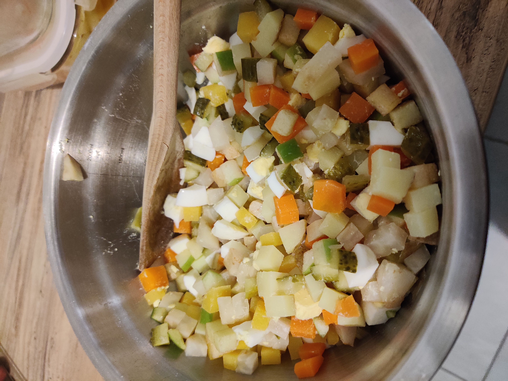

# Sałatka Jarzynowa: Polish Vegetable Salad
Sałatka jarzynowa (pron.: ‘Sawatcah yazhenova’) is a Polish-style Vegetable Salad. It has countless variations, but this classic version is essential at parties, festivities, and family gatherings.

**Yield:** 6-8 portions

**Prep Time:**
20 minutes

**Cook Time:**
30 minutes

**Total Time:**
50 minutes

## Ingredients
- 3 medium potatoes (approx. 0.8 lb, 12 oz, 350 g), waxy-type
- 4 large carrots (approx. 1 lb, 450 g)
2-3 parsley roots (approx. 0.5 lb, 225 g); can replace with more celeriac or turnip
- ½ small celeriac/celery root (approx. 9 oz, 250 g); can replace with parsley root
- 4 eggs
- ½ medium onion (approx. 2 oz, 50-60 g); white or yellow
- 4 large full sour fermented pickles (approx. 7 oz, 200 g)
- 1 large apple (approx. 7 oz, 200 g); ideally tart
- 1 can green sweet peas (approx. 14-15 oz, 400-425 g)
- 7 tablespoons mayonnaise
- 7 tablespoons sour cream; can replace with more mayonnaise
- 1 tablespoon mustard; mild or yellow
- ½ teaspoon salt
- ¼ teaspoon black pepper, ground

## Instructions
**Cooking the vegetables**

1. Wash all vegetables (potatoes, carrots, parsley roots and celeriac) thoroughly. Peel the celeriac, don’t peel the rest.
2. If the vegetables are large, cut them in large chunks. Place all vegetables into a large cooking pot.
3. Pour in enough water to cover them all (stock would be even better!). Cover with a lid and set the heat on ‘medium’. 
4. Cook vegetables until tender, but still firm - we don’t want them to fall apart in the salad. Usually, 30 minutes is enough, but that will depend on the thickness of your veggies. You can monitor them by ‘poking’ with a fork from time to time. Once they’re cooked, strain and leave to cool.
Cooking Eggs
5. As you wait, place eggs in the bottom of a saucepan. Fill the pan with cold water, just above the eggs.
6. Bring the water to a boil, then reduce the heat to a minimum and continue cooking for 9 minutes. 
7. Remove the eggs from the pan and into a smaller bowl. Cover them with cold water and set them aside to cool.

**Blanching Onion**
1. Peel the onion, and dice it finely, then move into a small bowl.
2. Cover with boiling water and leave for 15 seconds.
3. Use a sieve to strain the water off. Move the onions into a large salad bowl.

**Assembling the salad**
1. Peel full sour pickles and cut off the ends. Dice them into small cubes.
Squeeze out the excess juices with your hands and move the cukes into the salad bowl.
2. Peel the apple and cut out the core. Slice just like the pickles. Add to the salad bowl.
3. Peel cooked vegetables and gently dice them into cubes (mine are roughly sized at 0.3’’/8 mm per side). Add to bowl.
4. Peel the eggs, dice them as well. Add to bowl.
Open a can of green peas, get rid of the liquid. 
5. Pour the peas into the bowl.
6. Add in mayonnaise, sour cream, and mustard. Season with salt and pepper.
7. Gently stir to combine - try not to mash the vegetables. 
8. If you have the time, refrigerate at least 30 minutes before serving.

*https://www.polonist.com/salatka-jarzynowa-polish-vegetable-salad/*